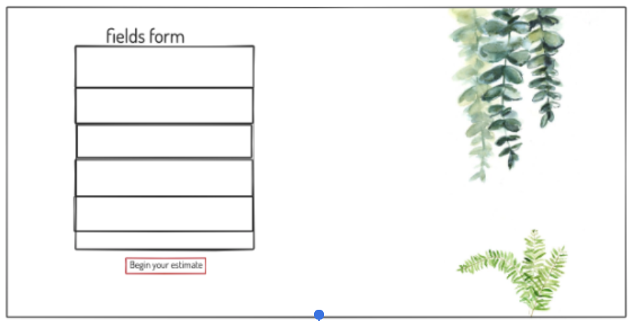
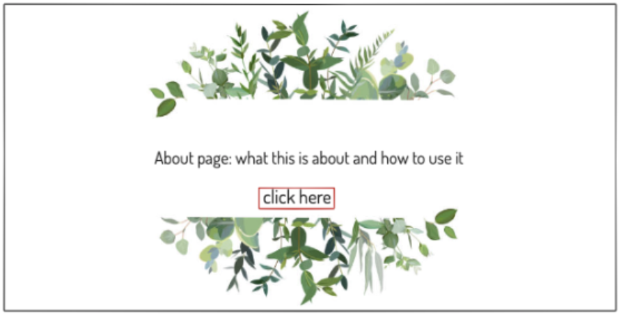
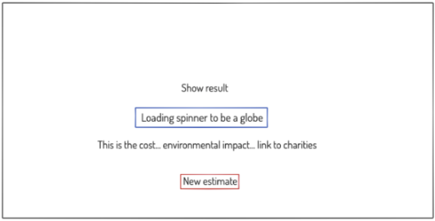
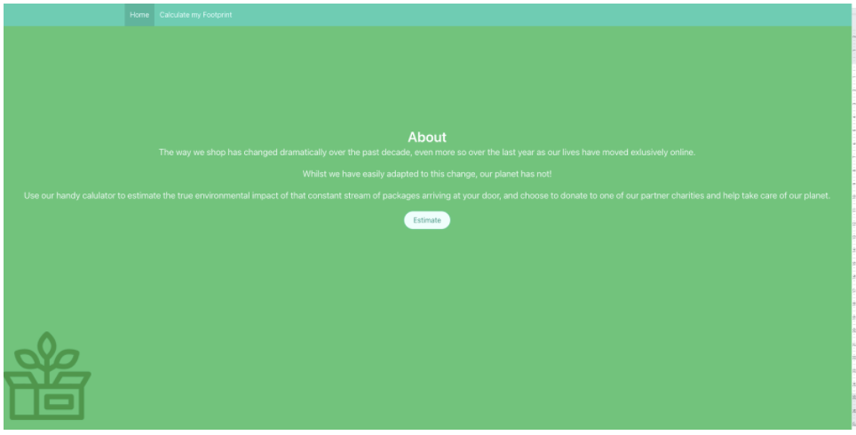
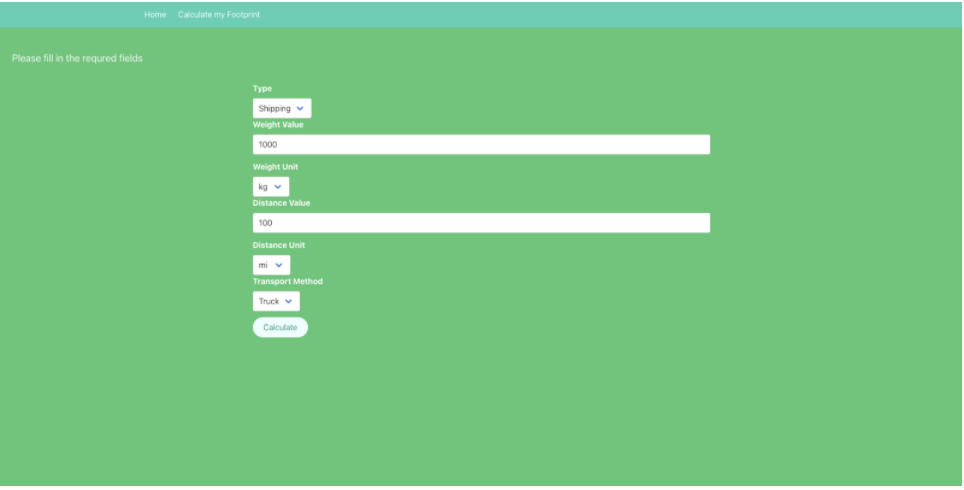
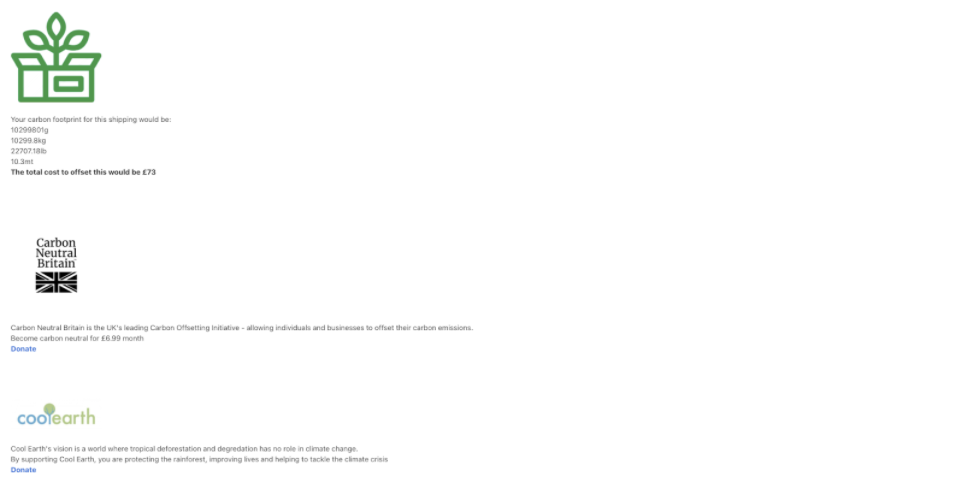

# Brief
* Work as a group/pair
* Consume a public API, relevant to the project
* Have several components 
* The app can have a router
* Include wireframes
* Be deployed online
* Working application
# Overview & Concept
I was able to work in my first group exercise for a 36-hour mock hackathon build utilising **React, API’s and deploying through Netlify.** The idea behind the app was based around current climate change and being conscious about our individual impact through shipping items, which saw a huge increase during 2020 and into 2021. **My main area for this project was being sure functionality was working for areas such as calculations and using the correct REST process for the API.** You can view the final deployed project [**here!**](https://carbon-footprint-dee912.netlify.app/).

# Technologies Used
* React 
* Axios 
* REST client
* Bulma and SASS
* Git and GitHub
* Google Fonts
* Carbon interface API and API keys

# Approach Taken (Thought process & methods of producing it, show where you took the lead)

## wireframes
* As a group we came up with the general idea of what we wanted to produce and I took the lead on getting the wireframes together so we had a point of reference to build from. 

### Form page

### About page

### Estimates page


* My idea here was to keep the design as clean as possible, to fit in with the overall idea.

## From page

* The form page was where the majority of the effort went into, I also took the lead here in getting the setup together.

* We read through the docs to be sure of what formData would be required to make a successful request from the API.

``` JavaScript

const [formData, setFormData] = React.useState({
   type: '',
   weight_value: 0,
   weight_unit: '',
   distance_value: 0,
   distance_unit: '',
   transport_method: '',
 })

```

From there we then began testing and building the front end for the form page to interact with the POST request correctly.

```JS
export function createFootprint(formData) {
 return axios.post(`${baseUrl}/estimates`,formData ,headers())
}

 const handleSubmit = async (e) => {
   e.preventDefault()
 
   try {
     const res = await createFootprint(formData)
     history.push(`/estimates/${res.data.data.id}`)
   } catch (error) {
     setIsError(true)
   }
 }

```
## estimates page

* Once the form page was together and working we moved onto the final page to show the estimates of CO2.

* We wanted the final page to be more than just showing a bunch of numbers and that being that. 
* We decided to include links to multiple charities that can help in offsetting your CO2 footprint with small donations. 
* We understood that on person paying of their own footprint wouldn’t change a lot but that if enough people saw the message we were trying to get across that it would then snowball into many more where the impact could be felt.

# Visuals (Code Snippets and Screenshots)

* Here is the final product after the 36 hours given:

## Home page

## From page

## Estimates page


* As you can see this differs from our original wireframes and this is due to us as a group wanting to have a try at our first CSS framework, Bulma.

# Bugs & Wins

## Bugs

One of the main bugs we ran into was a wording issue which took us a few hours to find. On the form page the last field, Transport Method, has 4 modes of transport: Ship, Train, Plane and Truck. Being from the UK we read the docs and without realising we put  Ship, Train, Plane and Lorry, this completely through the form off and and it wasn’t until we again line by line cross referenced that we realised we put Lorry instead of Truck in out possible options for transport methods.
## Wins

Had a really good team to work with, always happy to help each other if we found ourselves stuck. Overall the basic functionality works with a few features missing.
 
# Future Features + Key Learnings

## Future features

* Multiple type of carbon footprints to calculate, not just shipping
* A more finished design, especially on the calculations page
* Have charity links change depending on location

## Key learnings

* Basics of how to use data from an API
* Working with react for front end design
* What it’s like to work as part of a group
* The pros and cons of css frameworks 